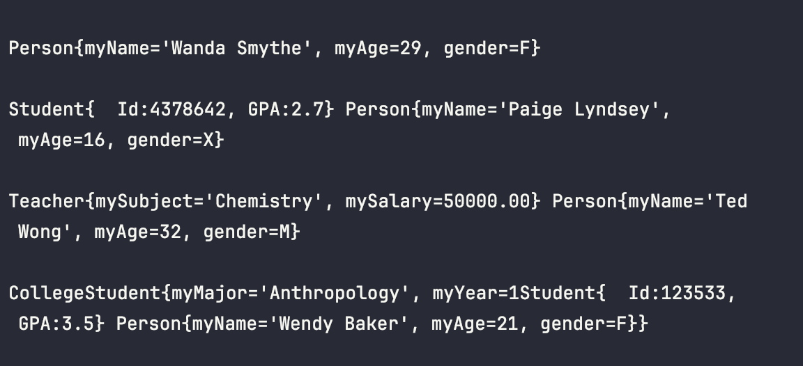
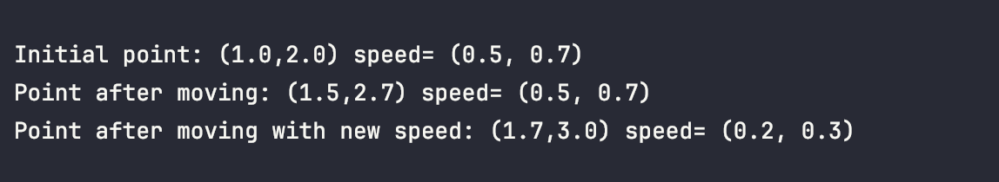
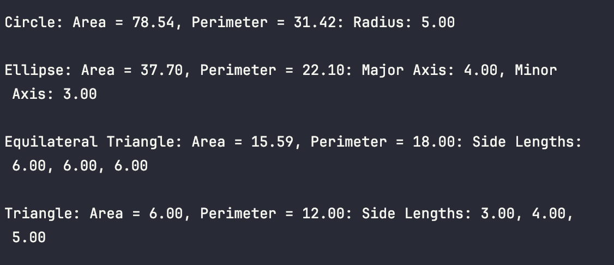
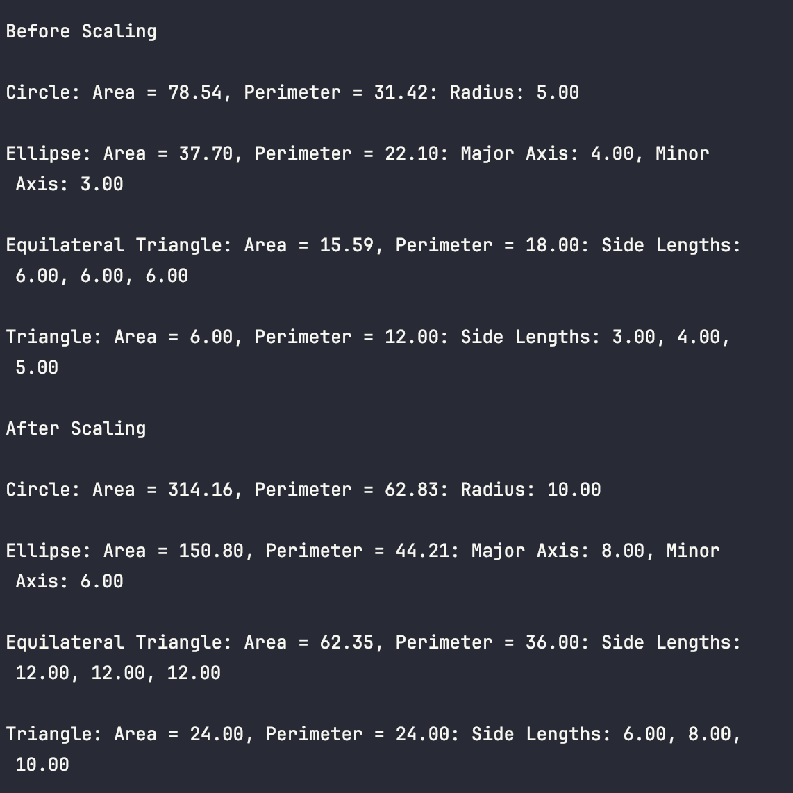

# Advanced Java QAP 3:

**Submitted**: March 16, 2025		**Name**: Jennifer

---

## Reflection Questions:

1. **How many hours did it take you to complete this assessment? Please provide an estimate of the time spent on each part.**
   It took around 5-6 hours to complete, mostly the maths of problem 3.
2. **What online resources did you utilize to complete this assessment?**
   I referenced a java course on O'Reily 
3. **Did you collaborate with any classmates to solve problems in this assessment? If so, please mention their name.**
   For this assessment I didn't discuss it much with other classmates.
4. **Did you require assistance from any instructors to complete this assessment? If so, please specify the number of questions asked or help sessions required.**
   Not for this assessment.
5. **Rate the difficulty of each question in this assessment from your perspective, and indicate whether you feel confident in applying similar techniques to solve different problems in the future.**
   None of the questions were too difficult, and it was great to exercise my understanding of Java objects using abstract classes and interfaces.

---

## Demo Problem 1 

## Demo Problem 2

## Demo Problem 3

## Demo Problem 4
